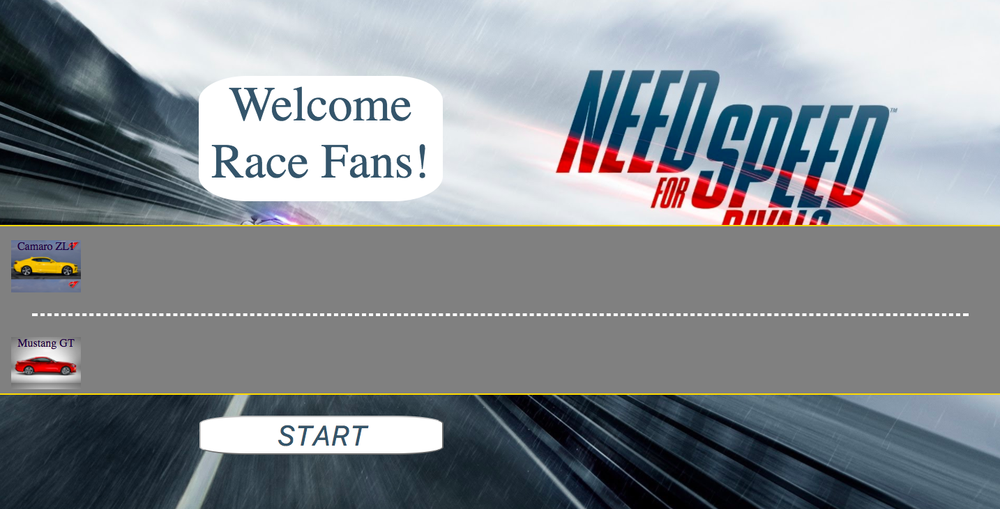
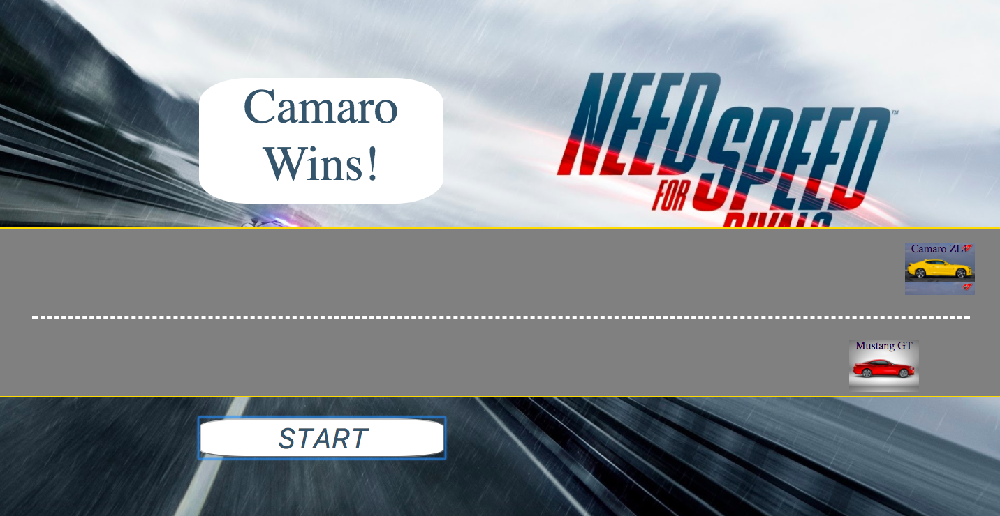

### JavaScript Racer Game

Two racers race across the screen. When the `right arrow` key or `z` is pressed, the racers move correspondingly.

## About the Game

- The landing page has a **"start"** button that triggers the function to begin the game.
- The white screen that shows the winner and announcements. 

# Technology used
- JavaScript
- HTML, CSS 

